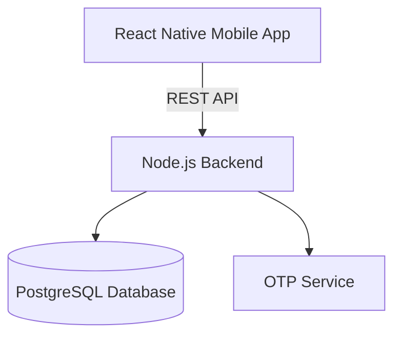

# 🌾 Harvest Rent MVP

**A mobile-first platform for renting agricultural equipment**
Harvest Rent is designed for the rural farming community, offering an easy way to list, discover, and rent harvesters and other machinery — much like Rapido for urban transport, but focused entirely on agriculture.

---

## 📌 Description

Harvest Rent bridges the gap between farmers who own heavy agricultural equipment and those who need it temporarily. It provides:

* **Seamless Equipment Listing:** Farmers can quickly post their machines with photos, pricing, and availability.
* **Effortless Booking:** Renters can browse available equipment, check schedules, and make bookings directly.
* **Local Focus:** Search and filter options to find machinery in nearby areas.
* **Simple Login:** OTP-based authentication for hassle-free access.
* **Scalable Backend:** Built with Node.js, Express, and PostgreSQL, deployed via Docker.

Whether you’re a farmer with idle machinery or someone in urgent need of a harvester during peak season, Harvest Rent makes the process straightforward, reliable, and efficient.

---

## 🚜 Key Features

* Equipment Listings with photos and pricing
* Real-time Booking Management
* Location-based Search & Filters
* OTP Authentication
* Cross-platform Mobile App (React Native)
* Dockerized Deployment for ease of setup

---

## 🏗️ Tech Stack

| Layer      | Technology               |
| ---------- | ------------------------ |
| Backend    | Node.js, Express         |
| Database   | PostgreSQL               |
| Mobile App | React Native (Expo)      |
| Auth       | OTP-based (demo service) |
| Deployment | Docker, Docker Compose   |

---

## 📂 Project Structure

```
harvest-rent-mvp/
├── backend/           # Node.js backend
│   ├── src/routes/     # API routes
│   ├── src/models/     # Database migrations
│   ├── src/services/   # OTP service, helpers
├── mobile/            # React Native mobile app
│   ├── screens/        # App screens (Search, Detail, Booking)
└── docker-compose.yml # Start backend + Postgres
```

---

## 📸 Screenshots

**Equipment Search Screen**

**Equipment Detail & Booking**

**Booking Confirmation**

---

## 📊 System Architecture



---

## 🚀 Getting Started

1️⃣ **Run Backend + Database**

```bash
docker-compose up --build
```

2️⃣ **Create Database Tables**

```bash
docker exec -it harvestrent-db psql -U postgres -d harvestrent -f /backend/src/models/migrations.sql
```

3️⃣ **Run Mobile App**

```bash
cd mobile
npm install
npx expo start
```

---

## 📅 Roadmap

* Payment Gateway Integration
* Live Location Tracking
* Reviews & Ratings System
* Multi-language Support

---

## 📝 License

MIT License

---

**Author:** Manideep Goud Gouraram
**Startup MVP Build – 2025**
